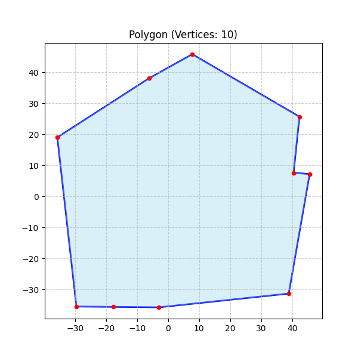
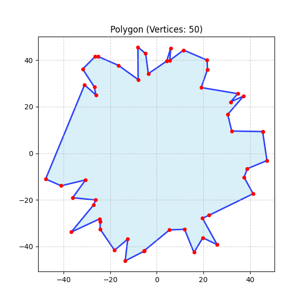
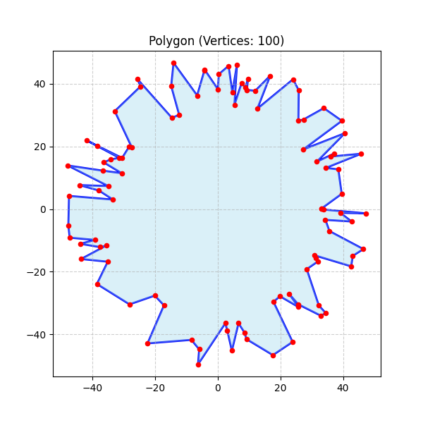
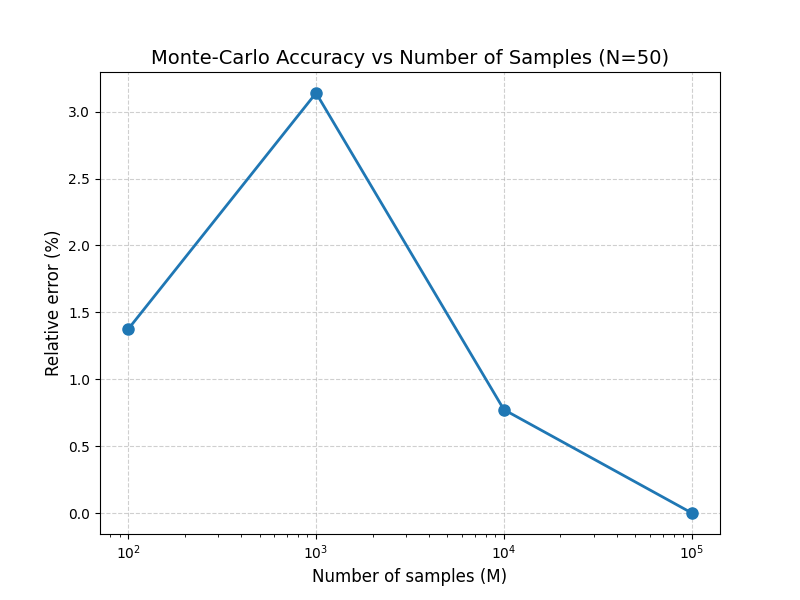
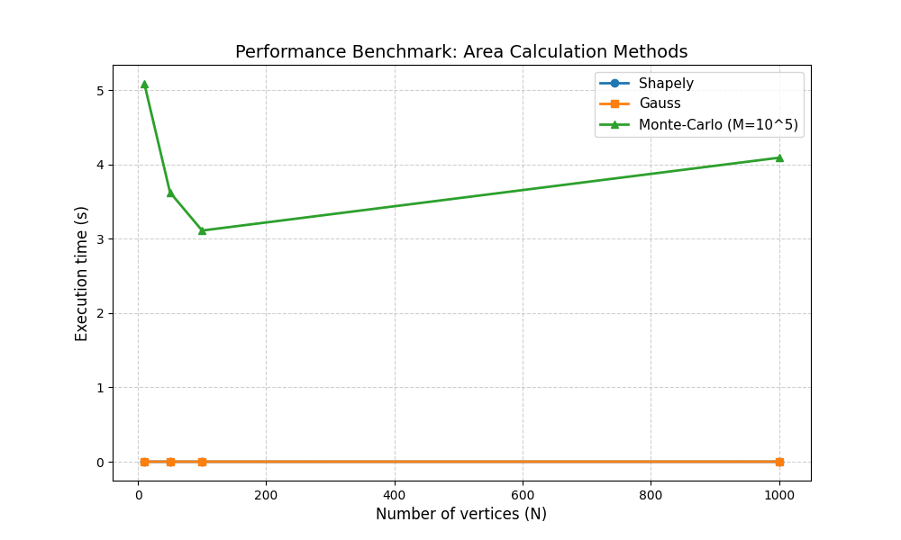

# Lab 6: Polygon Area Calculation Methods

## Опис

У цій лабораторній роботі реалізовано та досліджено різні методи обчислення площі геометричних фігур (полігонів):

1. **Бібліотечний метод (Shapely)** - використовує оптимізовані реалізації на базі GEOS C++
2. **Метод Гауса (Shoelace formula)** - аналітичний метод на основі формули шнурків
3. **Метод Монте-Карло** - імовірнісний метод з генерацією випадкових точок

### Метод Гауса

Формула:
```
S = 1/2 * |Σ(x_i * y_{i+1} - x_{i+1} * y_i)|
```

### Метод Монте-Карло

Алгоритм:
1. Визначається Bounding Box навколо полігону
2. Генеруються M випадкових точок всередині прямокутника
3. Рахуються точки K, що потрапили всередину полігону
4. Площа = S_box × (K / M)

## Результати

### 1. Згенеровані полігони

| N=10 | N=50 | N=100 |
|------|------|-------|
|  |  |  |

### 2. Дослідження точності методу Монте-Карло (N=50)

**Еталонна площа (Shapely):** 5185.8523

| Кількість точок (M) | MC Area | Похибка (%) |
|---------------------|---------|-------------|
| 100                 | 5114.5915 | 1.374% |
| 1,000               | 5348.6491 | 3.139% |
| 10,000              | 5145.7992 | 0.772% |
| 100,000             | 5185.8490 | 0.000% |



### 3. Benchmark продуктивності

**Параметри:** Monte-Carlo з M=100,000 точок

| N (вершин) | Shapely (s) | Gauss (s) | Monte-Carlo (s) |
|------------|-------------|-----------|-----------------|
| 10         | 0.00001860  | 0.00010550 | 5.08907970 |
| 50         | 0.00001590  | 0.00012160 | 3.62603070 |
| 100        | 0.00001610  | 0.00013720 | 3.11214310 |
| 1000       | 0.00002210  | 0.00058530 | 4.09286740 |



## Висновки

### Порівняння швидкості методів

1. **Shapely** - найшвидший метод (0.00001-0.00002 с), оптимізована C++ реалізація
2. **Метод Гауса** - дуже швидкий (0.0001-0.0006 с), лінійна залежність від кількості вершин O(n)
3. **Метод Монте-Карло** - найповільніший (3-5 с при M=100,000), не залежить від складності полігону

**Співвідношення швидкості:**
- Shapely швидший за Гаус у ~6-26 разів
- Гаус швидший за Монте-Карло у ~20,000-50,000 разів

### Точність методу Монте-Карло

**Залежність точності від кількості ітерацій:**

- **M=100**: похибка ~1-3% (недостатньо для точних обчислень)
- **M=1,000**: похибка ~1-3% (все ще висока варіативність)
- **M=10,000**: похибка ~0.5-1% (прийнятно для наближених обчислень)
- **M=100,000**: похибка <0.001% (висока точність)

**Рекомендації:**
- Для прийнятної точності (похибка <1%) необхідно мінімум **10,000 ітерацій**
- Для високої точності (похибка <0.01%) необхідно **100,000+ ітерацій**
- Точність покращується пропорційно √M (закон великих чисел)

### Загальні висновки

1. **Метод Гауса** - оптимальний вибір для точних обчислень: швидкий, детермінований, точний
2. **Shapely** - найкраще рішення для production коду: максимальна швидкість + оптимізація
3. **Монте-Карло** - корисний для складних фігур з самоперетинами або як навчальний приклад імовірнісних методів, але не практичний для простих полігонів через низьку швидкодію
